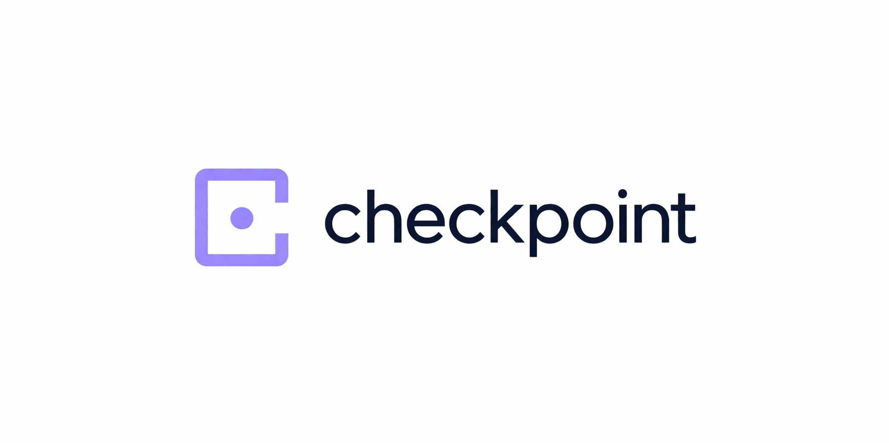
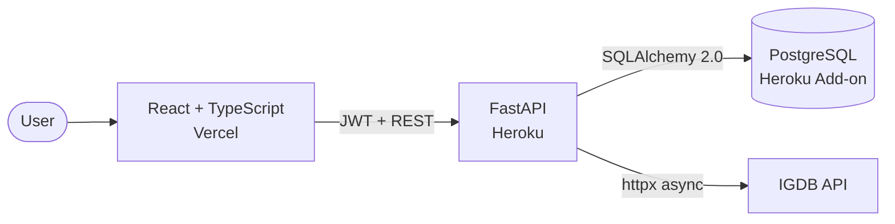

<a id="readme-top"></a>

<!-- PROJECT SHIELDS -->
[![CI][ci-shield]][ci-url]

<!-- PROJECT TITLE -->
<br />
<div align="center">
  
  <h1 align="center">Checkpoint</h1>

  <p align="center">
    A full-stack game tracking application — search, library, diary, lists, and a profile.
    <br />
    <br />
    <a href="https://checkpoint-delta.vercel.app">View Demo</a>
    ·
    <a href="https://checkpoint-api-a06342829980.herokuapp.com/docs">API Docs</a>
  </p>
</div>

<!-- TABLE OF CONTENTS -->
<details>
  <summary>Table of Contents</summary>
  <ol>
    <li>
      <a href="#about-the-project">About The Project</a>
      <ul>
        <li><a href="#built-with">Built With</a></li>
      </ul>
    </li>
    <li><a href="#features">Features</a></li>
    <li><a href="#architecture">Architecture</a></li>
    <li><a href="#key-technical-decisions">Key Technical Decisions</a></li>
    <li>
      <a href="#getting-started">Getting Started</a>
      <ul>
        <li><a href="#prerequisites">Prerequisites</a></li>
        <li><a href="#installation">Installation</a></li>
      </ul>
    </li>
    <li><a href="#testing">Testing</a></li>
  </ol>
</details>

<!-- ABOUT THE PROJECT -->
## About The Project

[![Profile screenshot][profile-screenshot]](https://checkpoint-delta.vercel.app)

Checkpoint is a full-stack game tracking application. Users search games from the IGDB database, organize them across four statuses (Playing, Completed, Want to Play, Dropped), rate them on a 1–10 scale, write reviews, keep an automatic diary of status changes (game starts, completions, and replays), build custom lists, and pick four all-time favorites — all surfaced on a profile page with stats, charts, and a monthly activity timeline.

![Dashboard screenshot][dashboard-screenshot]

Checkpoint is inspired by media tracking apps like Letterboxd and MyAnimeList. The project focuses on full-stack engineering end-to-end: external API integration, authentication, database design, deployment, and production hardening.

### Built With

[![FastAPI][FastAPI-shield]][FastAPI-url]
[![Python][Python-shield]][Python-url]
[![PostgreSQL][PostgreSQL-shield]][PostgreSQL-url]
[![React][React-shield]][React-url]
[![TypeScript][TypeScript-shield]][TypeScript-url]
[![Docker][Docker-shield]][Docker-url]

<!-- FEATURES -->
## Features

* **Authentication** — JWT auth with bcrypt password hashing and protected routes
* **Game Discovery** — IGDB search with edition/DLC filtering, genre chips, plus popular, new release, upcoming, and similar-game surfaces
* **Library Tracking** — Status, 1–10 ratings, and reviews (up to 2000 chars) across four statuses
* **Diary** — Automatic entries derived from status transitions, with replay support
* **Custom Lists** — Build themed game lists (e.g. "Best of 2024", "Want to Replay")
* **Favorite Games** — Pin four all-time favorites to your profile
* **Profile** — Personal profile at `/profile` with stats, favorites, charts, and a monthly activity timeline
* **Demo Account** — One-click demo login from the landing page

<!-- ARCHITECTURE -->
## Architecture



The backend exposes REST endpoints for authentication, IGDB-backed game discovery, library management, diary entries, custom lists, favorites, profile, and stats. IGDB remains the authoritative source for game data, but display metadata such as name, cover URL, and genres is cached on user-owned rows to avoid N+1 external API calls.

<!-- KEY TECHNICAL DECISIONS -->
## Key Technical Decisions

* **Auto-diary from status transitions** — Diary entries are not composed in a separate UI; they are derived from `user_games` status changes. Moving a game from Playing to Completed creates a diary entry, and moving a Completed game back to Playing starts a replay flow that can later produce another completion entry. This mirrors Letterboxd's review model and eliminates duplicate state between two writable surfaces.

* **N+1 problem solved** — `game_name` and `game_cover_url` are stored directly on the `user_games` table at insertion time, so listing a library or rendering the profile page is a single query with no IGDB round-trips.

* **IGDB integration: filtering, caching, refresh** — Discovery endpoints filter on `game_type` (the deprecated `category` field is no longer reliable) and order by `total_rating_count` to surface genuinely popular titles. The Twitch OAuth token is cached at module level with automatic refresh on 401 and retry.

* **Production hardening** — Heroku-specific fixes informed by real deployment behavior: `--proxy-headers` so the app respects the Heroku router's forwarded headers, `allow_origin_regex` CORS to accept Vercel's dynamic preview URLs, `pool_pre_ping` to handle idle PostgreSQL connection drops, and explicit indexes on common user-scoped foreign key columns such as `user_games.user_id`, `diary_entries.user_id`, and `game_lists.user_id`.

* **Centralized config** — A single `config.py` using `pydantic-settings` is the only `.env` reader in the codebase. Heroku's `postgres://` → `postgresql://` rewrite is handled via a property so the rest of the code stays unaware.

<!-- GETTING STARTED -->
## Getting Started

### Prerequisites

* Python 3.12+
* Node.js 18+
* PostgreSQL (only if running without Docker)
* Twitch Developer credentials for the IGDB API — [create an app](https://dev.twitch.tv/console/apps)

### Installation

**Option A — Docker (recommended)**

Docker Compose starts the backend and PostgreSQL. Run the frontend separately.

```sh
git clone https://github.com/tengrisaveus/checkpoint.git
cd checkpoint
cp .env.example .env   # Fill in TWITCH_CLIENT_ID and TWITCH_CLIENT_SECRET
docker compose up --build

# In a separate terminal
cd frontend
npm install
npm run dev
```

Backend at `http://localhost:8000`, frontend at `http://localhost:5173`.

**Option B — Manual**

```sh
# Backend
cd backend
python -m venv venv
source venv/bin/activate   # Windows: venv\Scripts\activate
pip install -r requirements.txt
cp .env.example .env       # Fill in credentials
alembic upgrade head
uvicorn main:app --reload

# Frontend (new terminal)
cd frontend
npm install
npm run dev
```

#### Environment Variables

| Variable | Description |
| --- | --- |
| `DATABASE_URL` | PostgreSQL connection string |
| `SECRET_KEY` | JWT signing key |
| `TWITCH_CLIENT_ID` | IGDB/Twitch API client ID |
| `TWITCH_CLIENT_SECRET` | IGDB/Twitch API client secret |
| `VITE_API_URL` | Backend URL for the frontend (e.g. `http://localhost:8000`) |

<!-- TESTING -->
## Testing

```sh
cd backend
pytest -v
```

42 tests covering authentication (register, login, duplicates, token flows), library CRUD with status transition rules, diary auto-creation invariants, profile, custom lists, favorites, library statistics, and the health endpoint. IGDB calls are stubbed via a `monkeypatch` autouse fixture, so the full suite runs hermetically in CI without external credentials. Tests use an isolated database (set via `TEST_DATABASE_URL`) with tables created and dropped per-test for guaranteed isolation.

<!-- MARKDOWN LINKS & IMAGES -->
[ci-shield]: https://img.shields.io/github/actions/workflow/status/tengrisaveus/checkpoint/ci.yml?branch=main&style=for-the-badge
[ci-url]: https://github.com/tengrisaveus/checkpoint/actions
[product-screenshot]: images/profile.png
[profile-screenshot]: images/profile.png
[dashboard-screenshot]: images/dashboard.png
[FastAPI-shield]: https://img.shields.io/badge/FastAPI-009688?style=for-the-badge&logo=fastapi&logoColor=white
[FastAPI-url]: https://fastapi.tiangolo.com/
[Python-shield]: https://img.shields.io/badge/Python_3.12-3776AB?style=for-the-badge&logo=python&logoColor=white
[Python-url]: https://www.python.org/
[PostgreSQL-shield]: https://img.shields.io/badge/PostgreSQL-4169E1?style=for-the-badge&logo=postgresql&logoColor=white
[PostgreSQL-url]: https://www.postgresql.org/
[React-shield]: https://img.shields.io/badge/React_19-20232A?style=for-the-badge&logo=react&logoColor=61DAFB
[React-url]: https://react.dev/
[TypeScript-shield]: https://img.shields.io/badge/TypeScript-3178C6?style=for-the-badge&logo=typescript&logoColor=white
[TypeScript-url]: https://www.typescriptlang.org/
[Docker-shield]: https://img.shields.io/badge/Docker-2496ED?style=for-the-badge&logo=docker&logoColor=white
[Docker-url]: https://www.docker.com/
